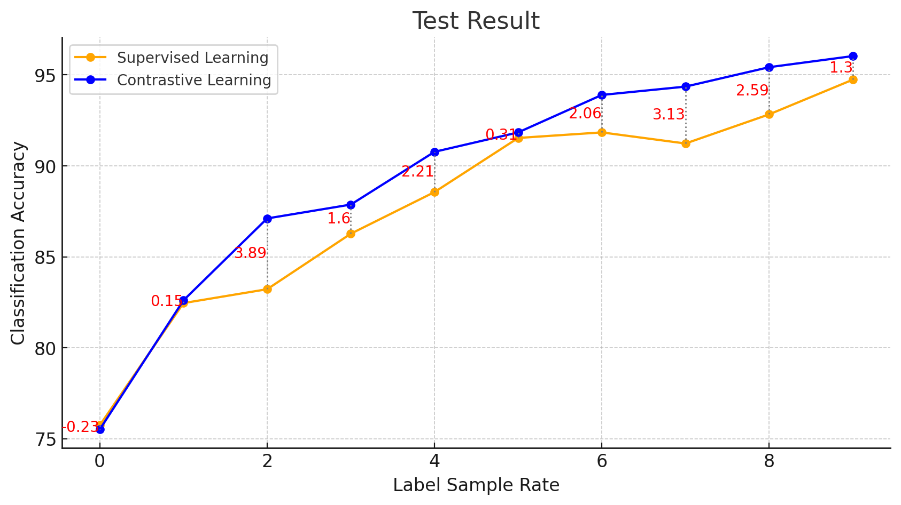
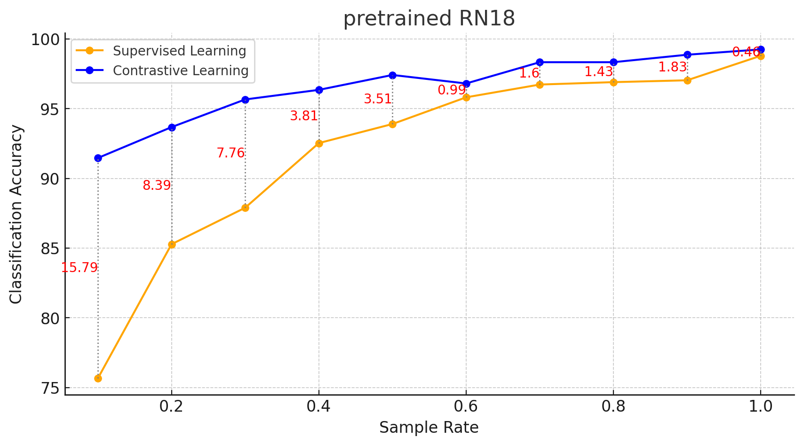

# Brain Tumor Classification with Contrastive Learning and Fine-Tuning

This repository implements a pipeline for brain tumor image classification using a combination of contrastive learning (self-supervised learning) and fine-tuning techniques. The project utilizes PyTorch and various utility modules for handling datasets, models, and training loops.

## Features
- **Contrastive Learning**: Pre-training of the feature extractor using self-supervised contrastive learning (InfoNCE Loss).
- **Fine-Tuning**: Training a classification head on a limited labeled dataset to predict tumor classes.
- **Data Augmentation**: Applies various transformations for robust training.
- **Logging**: Uses TensorBoard to log training and evaluation metrics.

## Setup Instructions

### Prerequisites
- Python 3.8+
- PyTorch
- torchvision
- TensorBoard for visualizations

### Running the Project

To run the training and evaluation process, execute:

python main.py

## Experiment Results

### Setup
We conducted experiments using two distinct backbone architectures: a shallow 4-layer CNN and a deep, pre-trained ResNet18. Both architectures utilized the same hyperparameters for consistency in evaluation:
- **Contrastive Learning Phase**: Batch Size = 128, 100 Training Epochs, Learning Rate = \( 1 \times 10^{-4} \)
- **Fine-Tuning Phase**: Batch Size = 30, 50 Training Epochs, Learning Rate = \( 1 \times 10^{-3} \)

We employed data augmentation techniques during the contrastive learning phase. Extensive testing revealed that a combination of Random Crop and Gaussian Blur provided optimal results. Below is the validation accuracy for different augmentation combinations on the shallow CNN model:

| Augmentation 1 | Augmentation 2 | Validation Accuracy |
| -------------- | -------------- | ------------------- |
| Crop           | Rotation       | 92.31%              |
| Crop           | Flip           | 77.02%              |
| Rotation       | Shear          | 93.58%              |
| Rotation       | Translate      | 91.24%              |
| Blur           | Flip           | 65.06%              |
| **Blur**       | **Crop**       | **96.03%**          |

### Shallow 4-layer CNN Results
The shallow CNN model showed consistent improvements in test accuracy as the label sample rate increased. Notably, the contrastive learning method outperformed traditional supervised learning at nearly every label sample rate, highlighting the advantage of leveraging unlabeled data in low-label settings.

### Deep Pretrained ResNet18 Results
In the deep pretrained ResNet18 model, both contrastive and supervised learning demonstrated improved test accuracy as more labels were used in fine-tuning. Pretrained features enabled the ResNet18 to achieve higher initial accuracy, particularly at lower label sample rates. Contrastive learning yielded larger gains when fewer labels were used, with the model achieving over 90% test accuracy using only 10% of the labeled data.

### Conclusion
Contrastive learning consistently leverages unlabeled data effectively, yielding significant performance gains, particularly when labeled data is scarce. The pretrained ResNet18 model demonstrates the advantages of transfer learning, offering higher accuracy even with minimal fine-tuning and achieving strong performance with a limited labeled dataset.
